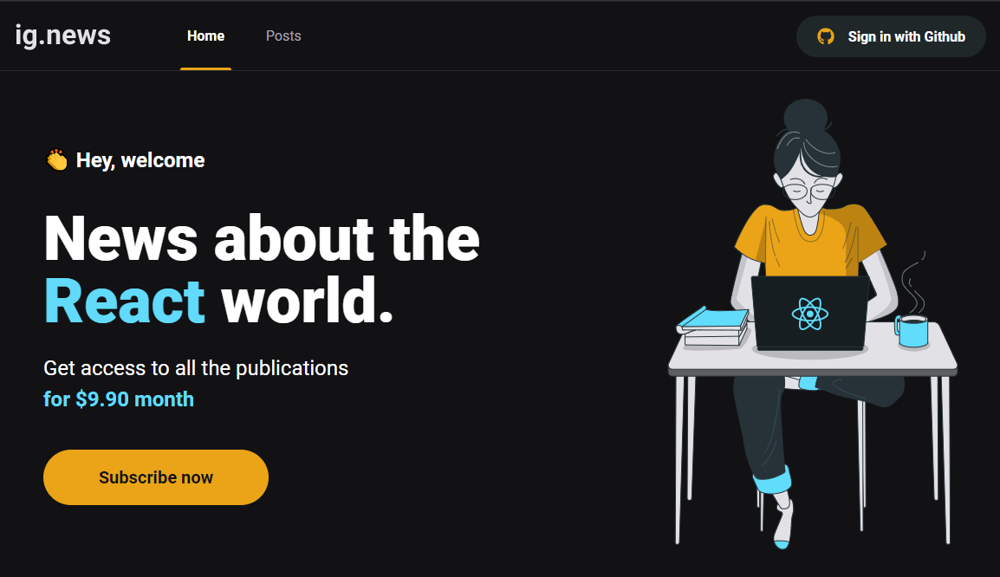
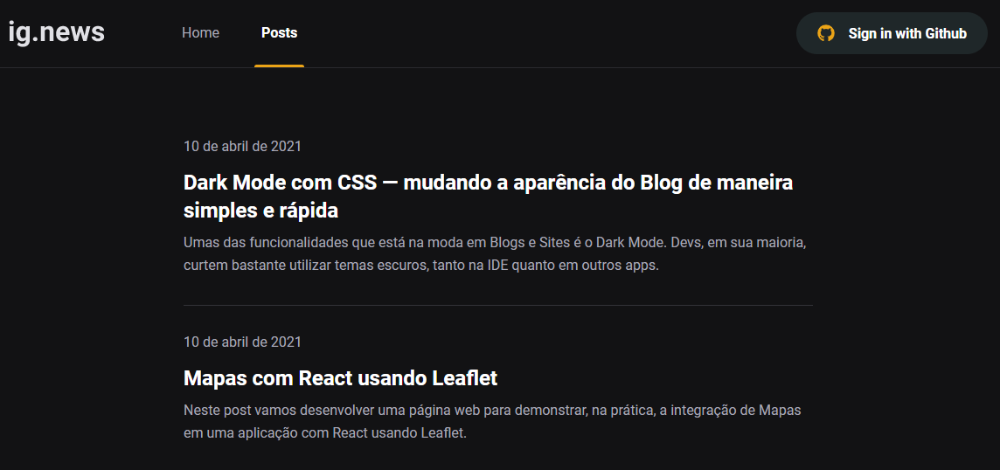

  IgNews

<h1 align="center">
    
</h1>

 

## 🧪 Tecnologias

Esse projeto foi desenvolvido com as seguintes tecnologias:

- [Next.Js](https://nextjs.org/)
- [Fauna](https://fauna.com/)
- [TypeScript](https://www.typescriptlang.org/)
- [Prismic](https://prismic.io/)
- [Stripe](https://stripe.com/en-br)

## 💻 Projeto

IgNews foi um dos principais projetos desenvolvidos durante o Bootcamp de mais  de 100hs de duração da trilha de ReactJs produzido pela [Rocketseat](https://github.com/Rocketseat) no ano de 2021.

Trata-se de uma plataforma de assinaturas para consumir artigos em texto, como posts de blog.

<h1 align="center">
    
</h1>

## 📝 License

Esse projeto está sob a licença MIT. Veja o arquivo [LICENSE](LICENSE.md) para mais detalhes.